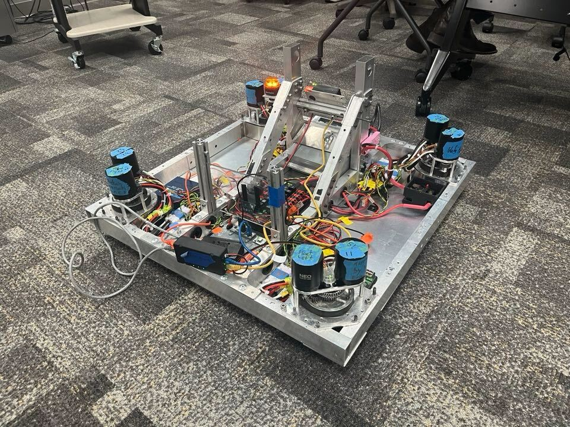

# Yet Another Generic Swerve Library (YAGSL) Example project

This is team `1317`'s fork of yagsl's example project! We used it to jumpstart our yagsl code this year and now are working in [df1317/2025-reefscape](https://github.com/df1317/2025-reefscape) we have a short video of it working here: [youtube.com/shorts/4eSLFHUsO9A](https://www.youtube.com/shorts/4eSLFHUsO9A)

